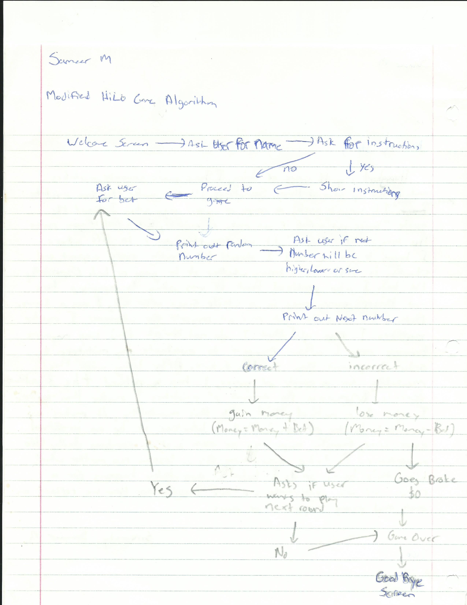

# HiLo-Betting-Game — Documentation
Programmed with Java for a culminating project that I did way back when

# Plan/Algorithm
-Create a game where it prints out a number and asks user to input whether the next number that will be printed will be higher, lower or the same
  - Use Math.Random twice to print the first and last number
      - Use array for the first number
      - Numbers should be 0-15
      - Answers should be either “a”, “b” or “c” <----- Use In.getChar();
    - Create a separate method for the game, instructions and screen clear
-	Create a loop for the game that way it keeps going over and over
    - (Use While, If and Boolean)
        - For each correct answer Boolean variable should remain true so game can continue. Otherwise, Boolean will be false and game will end
-	Create a scoring mechanism for the game in order to show progress and make it interesting
    - Create a variable score = 0
    - For each correct answer ----> (score++;)
    - For each correct answer  when user guesses that next number will be the same
        - Due to unlikelihood of this situation, (score = score + 10)
    - If user gets answer wrong, final score will be outputted and game will end
-	Create a welcome screen and goodbye screen
    - Ask for user name ------> In.getString();
    - Print out the name wherever possible. (e.g. near the end)
-	By now, game should be finished. From here, add comments where necessary and look for bugs in the game
-	From here, I should allow peers to test/play my game and ask for feedback in order to make the game better
-	Fix anything that game testers were complaining about
-	IF I end up having time by this point, I’ll make the game complicated by adding a betting mechanism. *note*  (I’d have to completely scrap the initial scoring mechanism)
    - I’ll do this by creating a “Money” variable where user starts off with $100
    - Before each round, game will ask user for Bet  ----> Bet = In.getInt();
    - If user wins round, Money = Money + Bet
    - If user loses, Money = Money – Bet
    - If user guesses the same and is right, due to low odds, Money = (Money +Bet) *2
    - If Money == 0, Game Over
-	Create loops in order to avoid incorrect/invalid inputs & errors
-	Allow user to choose whether they want to walk away with their money or not. 
-	Test the game several times. Fix any bugs and add any necessary comments
-	Allow peers to test my game and get feedback
-	Fix anything the game testers complain about and give code a proper style (indents)
-	Add anything else if necessary
 

# User Guide
a.	The purpose of this project is to create a game where it prints a random number and allow users to decide whether the following number will be greater, lesser or the same. This game will also give users an option to place bets with In-Game currency. This allows the players to reason and play the odds in order to gain more money. The game ends when the player runs out of funds or wants to quit. The intended audience for this game includes kids, teenagers and adults. This game can teach an individual how to play odds and how to bet based on their odds, making it a beneficial game in a way. This game can also serve as an alternative to real-life betting, that way users can play and pretend that they’re betting real money when in fact, they have nothing to lose since there is no real money on the line. 

b.	There are several different features that are used in this game. These features include…           

-	Welcome screen (Greets the user in a friendly manner)
-	Instructions (How to play)
-	Bets (Placed before each round)
-	Odds 
-	Choices (To walk away with your money or to continue betting)
-	Goodbye Screen (Kindly tells the user goodbye when player wins, loses or quits)

c.	In this program, there are several different situations where it asks the user to input a variable. These variables range in different data types. For instance, in the welcome screen, the program asks the user for a name which in this case, is a “string” variable. This data type was tested several times by inputting a series of letters and it worked properly fine. When a user enters a series of integers however, it will not output an error message. Instead, it will just store the series of numbers. The second data type used was “char” where a user is supposed to enter either “y” or “n” however, if the user enters any other type of variable, it will be considered that the user does not want to view the instructions. I tested this by entering characters, strings and integers whenever it comes to this point of the game and it would not show the instructions if “y” was not inputted. “Char” was also used during the game when the user had to guess higher, lower or the same. This was tested by inputting characters, strings and integers. Inputting anything other than the 3 designated characters that are asked for, it would result in asking the same question again one more time. “Char” would also be used at the end of each round whenever the game asked the user to play again. This was tested the same way as the other “char” situations. Lastly, the data type “int” was used in this game whenever the game output a number, score or asked the user for a bet. This was also tested by inputting different data types into the “int” input and no error message would come up however, by inputting anything other than an int as an input would result in the continuation of the game with no bet. This bug will have to be fixed in the future.

d.	This program is expected to output a welcome screen, instruction guide if requested, the game and a goodbye screen. The game itself was expected to output a random number, a question for the user to answer, a second number, whether the user has won or lost the round, the amount of money gained or lost as well as the total amount of money and the option whether to the user wants to play again or not.

e.	The user can simply terminate the program after a round of betting when the game itself asks the user whether they want to continue on with the game or not. By entering “n” when asked to play the next round, the game advances to the goodbye screen.

# Testing Data
This program was tested by several people including myself. I’d first test the game myself to make sure it was playable and interesting for others to play. I’d test my own game by inputting all sorts of different stuff even when it didn’t make sense to look for bugs (e.g. when game asked for name, I’d put numbers). If I found a bug, I’d fix it immediately and start testing the game all over from the beginning. When I felt satisfied with my own game, I would let my peers with knowledge in Java test my game in order to receive constructive criticism by them. Whenever one of my peer testers would find a bug or make a recommendation, I’d listen to them and fix my code immediately then start testing it all over again. When finally both my peers who are familiar with Java and I are satisfied, I let users who have no knowledge in computer science test out my game in order to hear their feedback. Based on the feedback I’d get, I’d fix a few minor things in my code every once in a while. 

# Known Errors/Bugs
While building my project and writing my code, I have made many mistakes and this resulted into a couple of errors along my way. I did the best I could to fix any of these errors that I have encountered. Most of my errors had to do with missing semi-colons, braces and etc. Not only did I have to deal with errors, but I also had to deal with bugs in my game as well. One of my first bugs that I came across was when I was creating the loop for the game using “while” and I’d get stuck in an infinite loop. I fixed this bug by making my while conditions more strict using both Boolean and another variable. Most of my other bugs had to do with user input situations. For instance, whenever the game asked whether the next number will be higher, lower or the same, if the user were to input any other answer, the game would totally disregard it and continue. I fixed this by making the “if” conditions more specific for each circumstance. Also, whenever the game asked for the bet amount, the user could have entered a higher bet amount than the amount of money they have or even a negative bet. I fixed this by making a “while” loop where it requires the user to enter a valid bet with a positive value in order for the game to continue. Lastly, whenever the game asks for the bet amount, the user can input a value that is not an integer (e.g. string) and the game will totally ignore it and continue the game with no bet being placed. Unlike the other bugs encountered, this bug was not fixable since I was not able to make a loop or selection statement that would keep asking the user to enter a valid input if the user were to enter an invalid input. The best I was able to do about this bug was to be clear and clarify to the user that a valid bet with a positive integer should be input. 

# Game Summary
Modified Hi-Lo is a gambling game where a number between 0 and 15 is printed and the user is asked to guess whether the next random number between 0 and 15 will be higher, lower or the same. This game will have an endless amount of rounds and the game will go on for as long as the user wants to play and has sufficient in-game money funds. Before each round, the user will be opted to place a bet and based on whether they get an answer correct or not for each round determines whether the user will gain or lose money with respect to their bets. 

All users who play Modified Hi-Lo will start with a fair amount of $20. With this $20, the user can either work their way up and become insanely rich or lose all their money and become broke. The user is given the option to quit the game any time they want after each round and walk away with the money they have earned or play until the user loses all their money and ends up with $0.

Before each round, the total amount of money the user possesses will be displayed and the user will be asked how much money they would like to bet for that round. After the bet has been placed, a random number will be printed surrounded by 2 square brackets (e.g. [9]). The user will then have to play the odds or take a risk on whether the next random number will be greater, lesser or the same as the initial random number. Also, due to the extremely low chances of the next random number being the same, if the user were to guess that the next number will be the same, the user will gain 4x the amount of their bet for that round. Bets are placed before the initial random number is output because this makes the game a lot more challenging and interesting.

Users are expected to follow the instructions. If user chooses not to follow instructions multiple times, a loss could be a result. This means that whenever an integer is requested, an integer should be the input. The same situation goes for “string” and “char” inputs. 

After each game is over due to the user going broke or intentionally quitting, the game will ask the user if they want to start a NEW game. If the user decides to play again, the Money count will be RESET and everything will start from the beginning. If you have any feedback, contact info will be displayed at the end of the game. Feedback will be greatly appreciated in order to make Modified Hi-Lo a better game. 
Enjoy!

Note: *This game is for educational and fun purposes only. This game does not encourage real-life gambling or anything of the sort*
